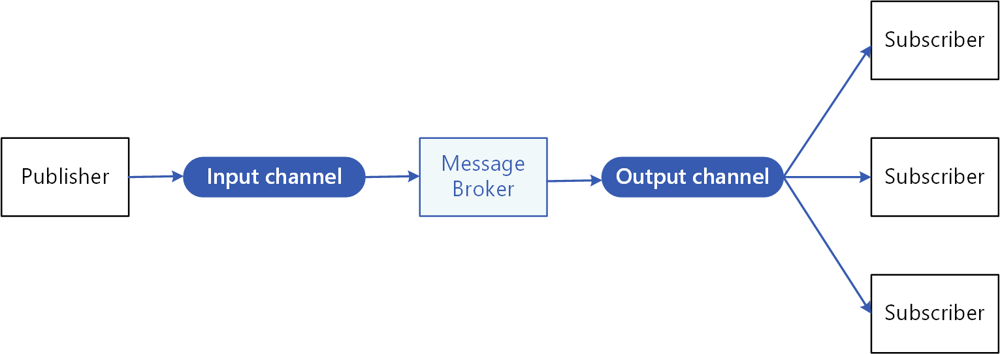

# پکیج python redis pubsub

## درپاره پروژه
این یک پکیج cli هست که می‌تونی یه سری پکیج از یه جایی ارسال (انتشار) کنی و در یه جای دیگه اون پکیج دریافت کنی

## درپاره معماری
ما از الگوی pub-sub برای معماری پروژه‌مون استفاده کردیم، ردیس به عنوان یک message broker در این معماری آوردیم.
این یک معماری ایونت-دریونه که از ارسال‌کننده (پابلیشر)، دریافت‌کننده (سابسکرایبر) و بروکر تشکیل شده. یک سرویس ارسال‌گر می‌تونه پیام ارسال (انتشار)کنه و چندین دریافت‌گر من‌تونن این پیام دریافت (گوش) کنند و پروکر مدیریت ارسال این پیام‌ها رو به عهده داره.

مثل ایستگاه رادیویی که میشه برنامه‌های مختلفی از اون فرستاد و چندین رادیو به آن می‌تونن گوش کنن.
